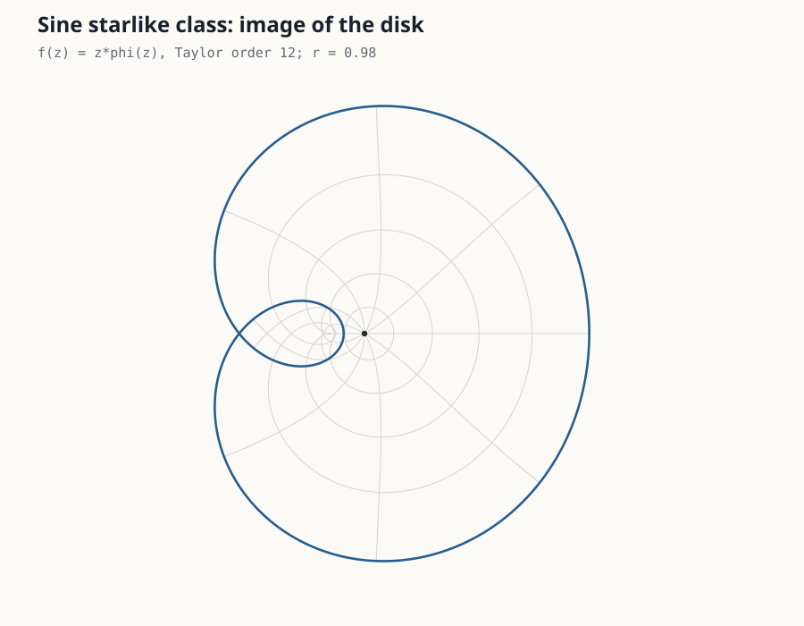
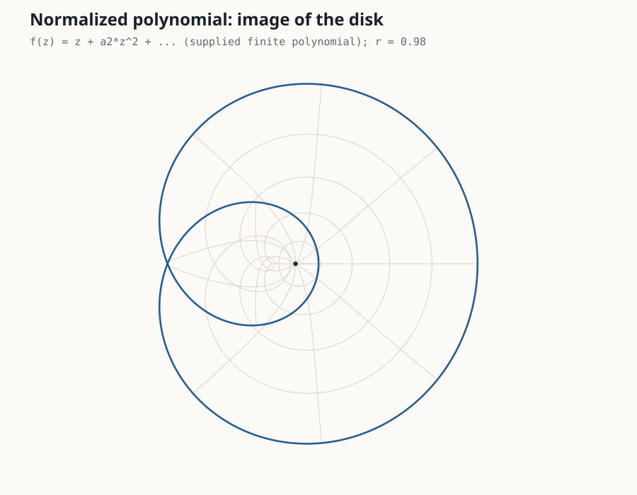

# Geometric Function Atlas

Reproduce geometric-function-theory computations from the [Geometric Function Atlas](https://gft-registry.fly.dev) on your own computer.

The command line is deliberately short: choose a named class, ask a mathematical question, and get a readable answer. Exact values, verification details, provenance, and JSON remain available when they are needed.

[](https://pypi.org/project/geometric-function-atlas/)
[](https://pypi.org/project/geometric-function-atlas/)
[](https://github.com/Prasanna28Devadiga/geometric-function-atlas/actions/workflows/ci.yml)

## Install

You do **not** need to install Python. The supported installers obtain `uv`, a managed Python 3.12 runtime, and every dependency.

<table>
<tr><th>macOS / Linux</th><th>Windows PowerShell</th></tr>
<tr><td>

```bash
curl -LsSf https://raw.githubusercontent.com/Prasanna28Devadiga/geometric-function-atlas/main/scripts/install.sh | sh
```

</td><td>

```powershell
irm https://raw.githubusercontent.com/Prasanna28Devadiga/geometric-function-atlas/main/scripts/install.ps1 | iex
```

</td></tr>
</table>

If `uv` is already installed:

```bash
uv tool install --managed-python geometric-function-atlas
```

Restart the terminal once and check:

```bash
gfa --version
```

## What you can do

| Question | Command |
|---|---|
| Which Ma–Minda generators are built in? | `gfa generators` |
| What are the exact Taylor coefficients of a generator? | `gfa coefficients sine --order 6` |
| What is the exact Ma–Minda Fekete–Szegő constant? | `gfa fekete-szego exponential --mu 1/2` |
| Does this supplied point certify a counterexample? | `gfa verify-counterexample --coefficients "1" --point=-0.75,0` |
| What does the mapped disk look like? | `gfa plot sine --output sine-domain.svg` |
| Can I use my own normalized polynomial? | `gfa plot --coefficients "1,-0.25" --output polynomial.svg` |
| Can another program consume the result? | Add `--json` to the computational commands |
| Can I call the mathematics from Python? | Use the [Python API](#python-api) |

The longer executable name, `geometric-function-atlas`, works everywhere that `gfa` does.

## Plot a function domain

```bash
gfa plot sine --order 12 --output sine-domain.svg
```

This draws concentric circles and radial spokes after applying the Taylor polynomial for

\[
f(z)=z\,\varphi(z),\qquad \varphi(z)=1+\sin z.
\]



The SVG is standalone, publication-friendly, and needs no plotting library. The caption records the truncation order and sampled radius. It is a visualization of a finite Taylor polynomial—not a proof of the full analytic image domain.

For a normalized polynomial

\[
f(z)=z+z^2-\tfrac14z^3,
\]

run:

```bash
gfa plot --coefficients "1,-0.25" --output polynomial.svg
```



The supplied coefficients describe the finite polynomial
\(f(z)=z+z^2-\tfrac14z^3\) directly; they are not interpreted as a new
generator formula.

Useful controls:

```bash
gfa plot sine \
  --order 16 \
  --radius 0.95 \
  --rings 6 \
  --spokes 16 \
  --output sine-domain.svg
```

The plotting command reports its scope explicitly:

```text
Wrote sine-domain.svg
Model: f(z) = z*phi(z), Taylor order 16
Scope: visualization of a finite Taylor polynomial; not a proof of the full image domain
```

## Browse the built-in classes

```bash
gfa generators
```

The catalog currently exposes these familiar keys:

| Key | Generator \(\varphi(z)\) |
|---|---|
| `bell` | \(\exp(e^z-1)\) |
| `cosh_sqrt` | \(\cosh\sqrt z\) |
| `crescent` | \(z+\sqrt{1+z^2}\) |
| `exponential` | \(e^z\) |
| `lemniscate` | \(\sqrt{1+z}\) |
| `rational_kr` | Kumar–Ravichandran rational generator |
| `sigmoid` | \(2/(1+e^{-z})\) |
| `sine` | \(1+\sin z\) |
| `starlike` | \((1+z)/(1-z)\) |

Each catalog entry carries its name, formula, and source citation.

## Compute exact generator coefficients

```bash
gfa coefficients sine --order 5
```

The returned coefficients are \(B_1,\ldots,B_5\) in

\[
\varphi(z)=1+B_1z+B_2z^2+\cdots.
\]

For `sine`, the exact values are

```text
1, 0, -1/6, 0, 1/120
```

Nothing is rounded before the symbolic result is formed.

## Compute an exact Fekete–Szegő constant

```bash
gfa fekete-szego exponential --mu 0
```

For the exponential Ma–Minda class this returns

```text
value_exact: 3/4
```

The operation checks the generator normalization and the assumptions of the declared Ma–Minda closed form. An exact rational input such as `--mu 1/2` stays exact; decimal and scientific notation are deliberately rejected.

## Verify a supplied counterexample witness

For

\[
f(z)=z+z^2,
\]

re-check the witness \(z=-3/4\):

```bash
gfa verify-counterexample \
  --coefficients "1" \
  --point=-0.75,0
```

Output:

```text
CERTIFIED COUNTEREXAMPLE
Criterion: starlikeness
Witness: z = -0.75 + 0i
Certified value: [-2, -2]
Counterexample condition: value <= 0
```

The verifier uses interval arithmetic at the supplied point. It does **not** search the disk or claim global discovery. A Becker or Nehari threshold violation is reported only as failure of that sufficient criterion; it is not presented as proof of non-univalence.

Supported checks:

```text
starlike
becker_univalent
nehari_univalent
```

## JSON and reproducibility

Add `--json` when a notebook, script, or independent verifier needs structured output:

```bash
gfa coefficients sine --order 5 --json
gfa fekete-szego exponential --mu 1/2 --json
gfa verify-counterexample --coefficients "1" --point=-0.75,0 --json
```

JSON results preserve exact expressions separately from decimal approximations and include the method, assumptions, evidence state, package version, source references, and verification checks. The public result and error formats are closed and versioned; see [`docs/RESULT_CONTRACT.md`](docs/RESULT_CONTRACT.md).

## Python API

```python
from geometric_function_atlas import (
    fekete_szego,
    generator_series,
    verify_counterexample,
    write_domain_plot,
)

series = generator_series("sine", order=5)
print(series.coefficients)
# (1, 0, -1/6, 0, 1/120)

constant = fekete_szego("exponential", mu="1/2")
print(constant.value)

witness = verify_counterexample(
    [1],
    point=(-0.75, 0.0),
    property="starlike",
)
print(witness.certified)
# True

write_domain_plot(
    "sine-domain.svg",
    generator="sine",
    order=12,
)
```

Custom generators use preconstructed SymPy expressions. Formula strings are not evaluated:

```python
from geometric_function_atlas import Generator, generator_series, z

custom = Generator(
    key="custom",
    name="Example",
    expression=1 + 2*z + 3*z**2,
    citation="User supplied",
)

print(generator_series(custom, order=4).coefficients)
```

The caller remains responsible for any analytic admissibility assumptions attached to a custom generator. Undeclared free symbols are rejected.

## Explore the full Atlas

The repository is the independently installable computation layer. The website presents the wider research corpus and interactive views:

- [Function families](https://gft-registry.fly.dev/families)
- [Verify and counterexamples](https://gft-registry.fly.dev/verify)
- [Machine-certified bounds](https://gft-registry.fly.dev/proofs)
- [Coefficient expansions](https://gft-registry.fly.dev/expansions)
- [Class hierarchy](https://gft-registry.fly.dev/hierarchy)
- [Image Lab](https://gft-registry.fly.dev/lab/)
- [Cryptography Lab](https://gft-registry.fly.dev/crypto-lab/)
- [Papers and extracted claims](https://gft-registry.fly.dev/papers)

The precise website-to-package coverage rule is recorded in [`docs/WEB_PARITY.md`](docs/WEB_PARITY.md). Provenance and claim boundaries are described in [`docs/PROVENANCE.md`](docs/PROVENANCE.md).

## Development

The lockfile is committed. Development and release gates use locked or frozen dependency resolution.

```bash
uv sync --extra test --locked
uv run --frozen python -W error -m pytest -q
uv run --frozen python -m ruff check src tests scripts
uv run --frozen python -m mypy src --ignore-missing-imports
```

## Scientific status

Every computational result states what was checked and how. Exact symbolic results, interval-certified pointwise statements, numerical evidence, literature provenance, and novelty review are different kinds of evidence and remain visibly distinct.

## License

MIT
